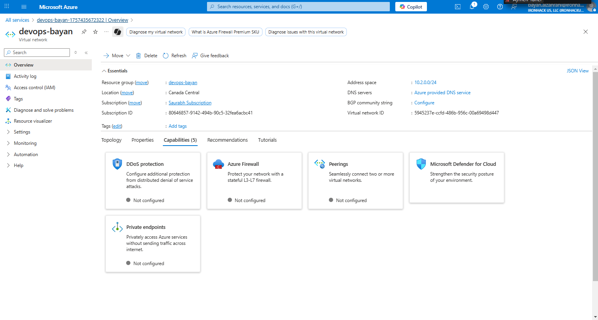
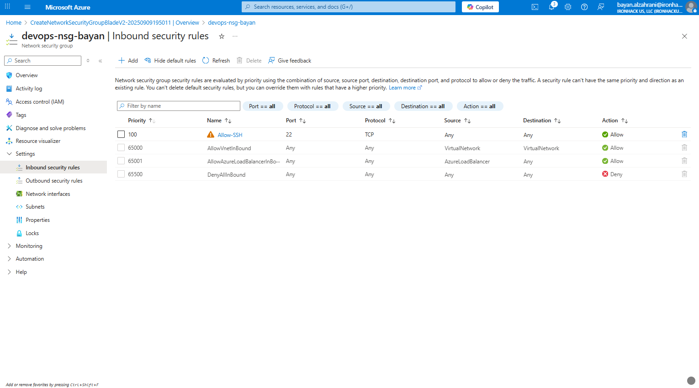
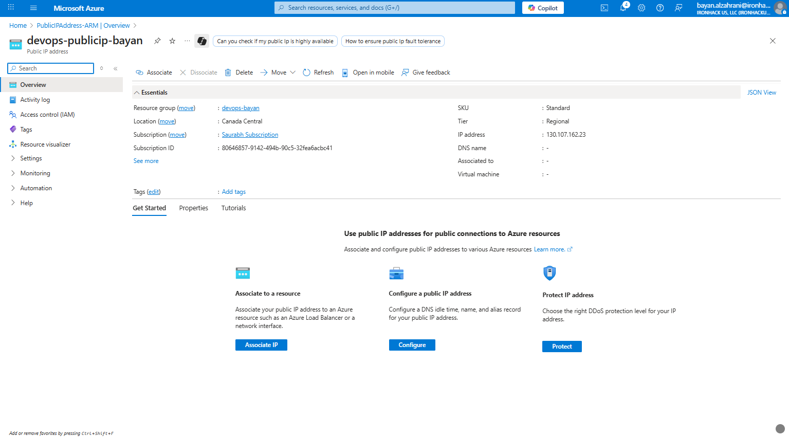
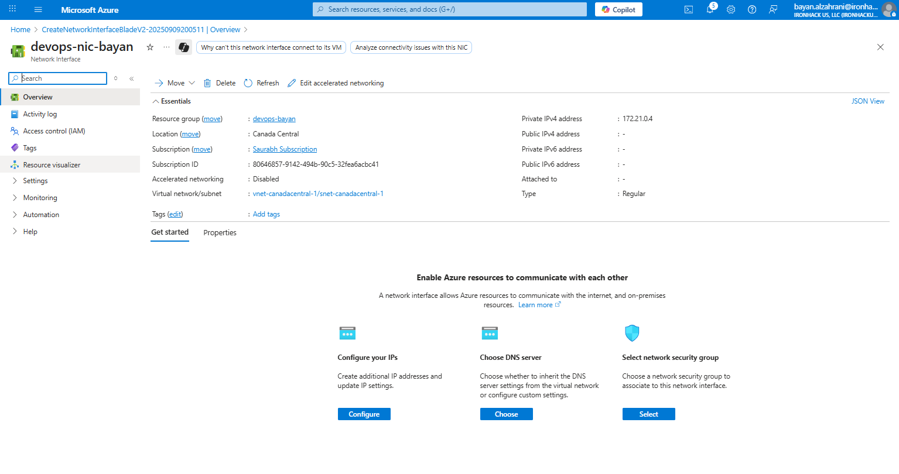
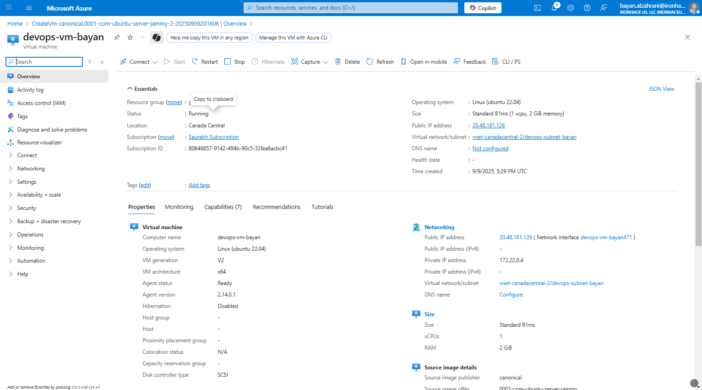
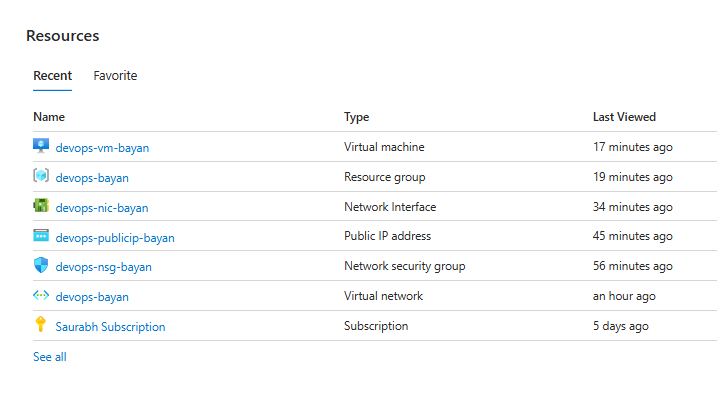
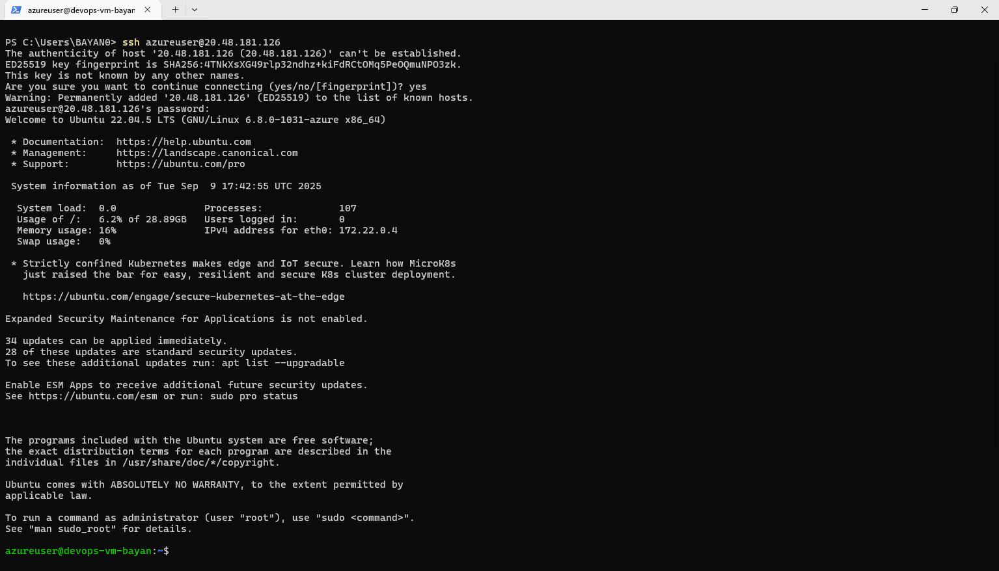

# Lab Solution - Week 2
# Provision VM with All Networking Components

1. **Create Resource Group**
3. **Create Virtual Network (VNet) & Subnet**
    

5. **Create Network Security Group (NSG)**
   

7. **Create Puplic IP Address**
   
   
9. **Create Network Interface Card**
       

10. **Create VM**
    

    ##Resource
    

12. **Test Connect**
    
  
