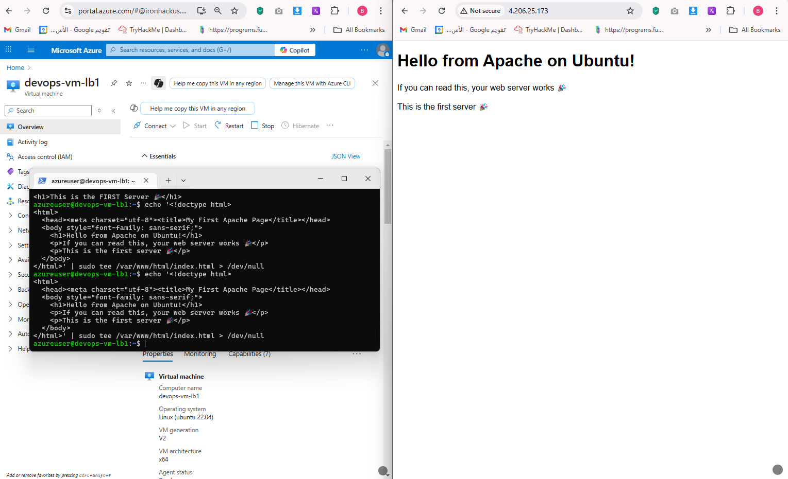

# Lab Solution - Week 2

## Provision Load Balancer (Load Balancing Two Linux Web Servers)

1. **Create VM**  

2. **First Server Setup**  

3. **Second Server Setup**  

4. **Load Balancer**  

5. **Load Balancer - Step 1**  

6. **Load Balancer - Step 2**  

7. **Test the Load Balancer**  

