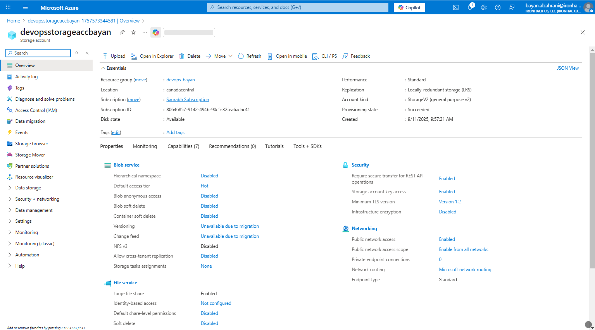
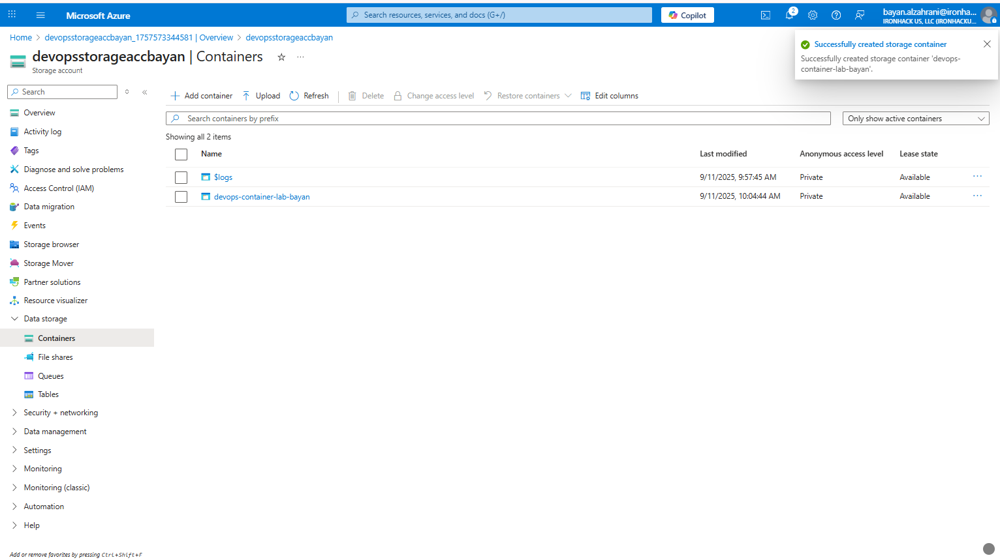
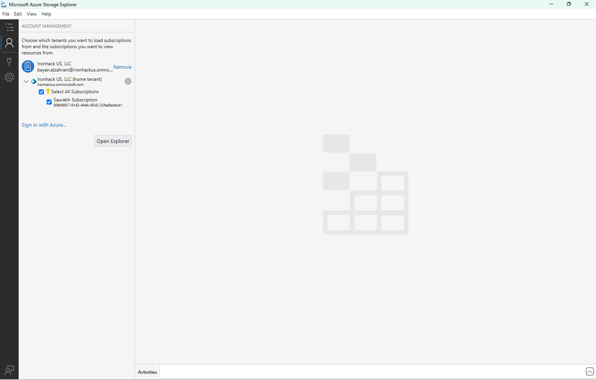
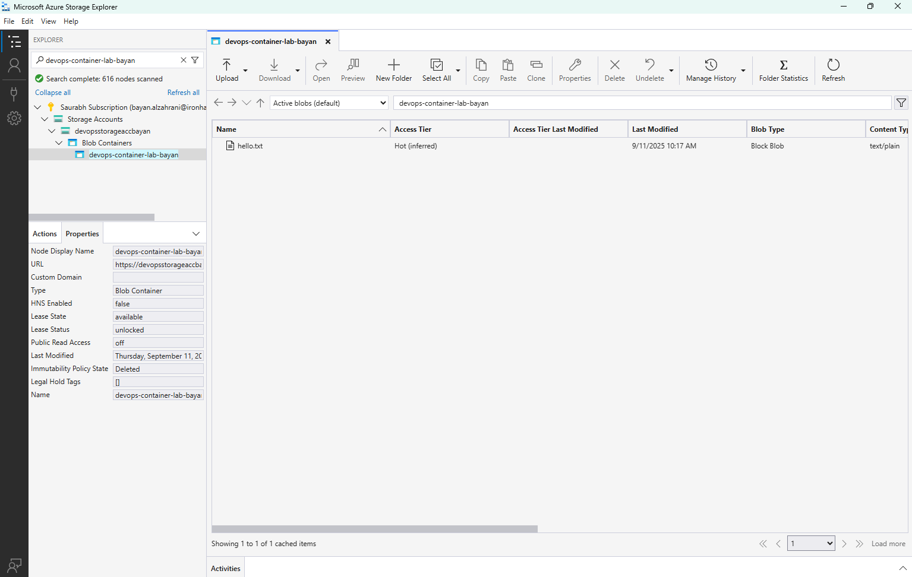

# Lab Solution - Week 2

## Provision Azure Blob Storage and Connect via Azure Storage Explorer

1. **Create Storage Account**  

2. **Create Blob Container**  

3. **Upload File to Blob**  
.png)

4. **Access via Azure Storage**  

5. **Verify in Azure Storage Explorer**  

