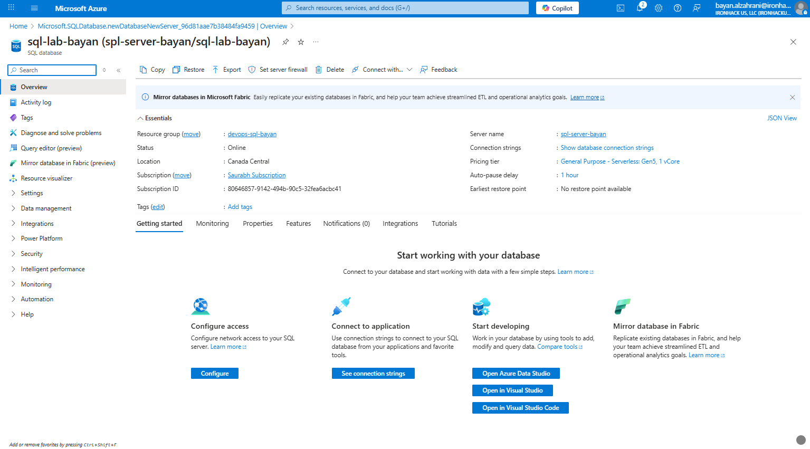
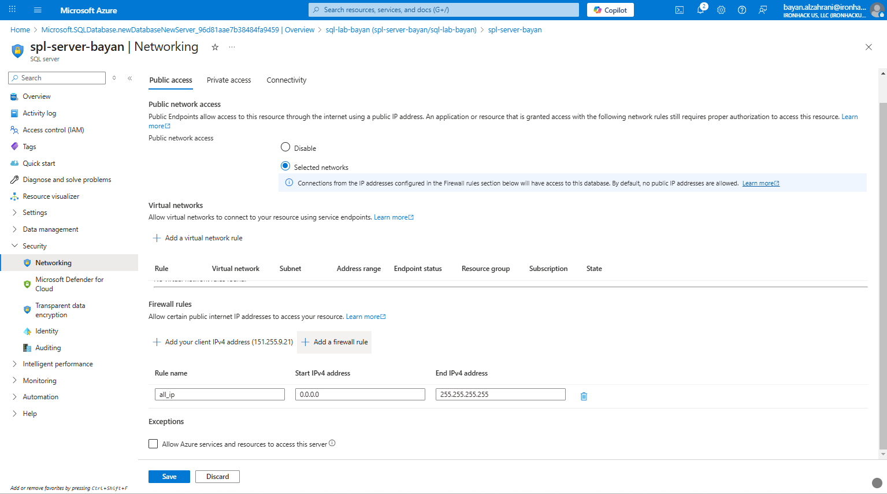
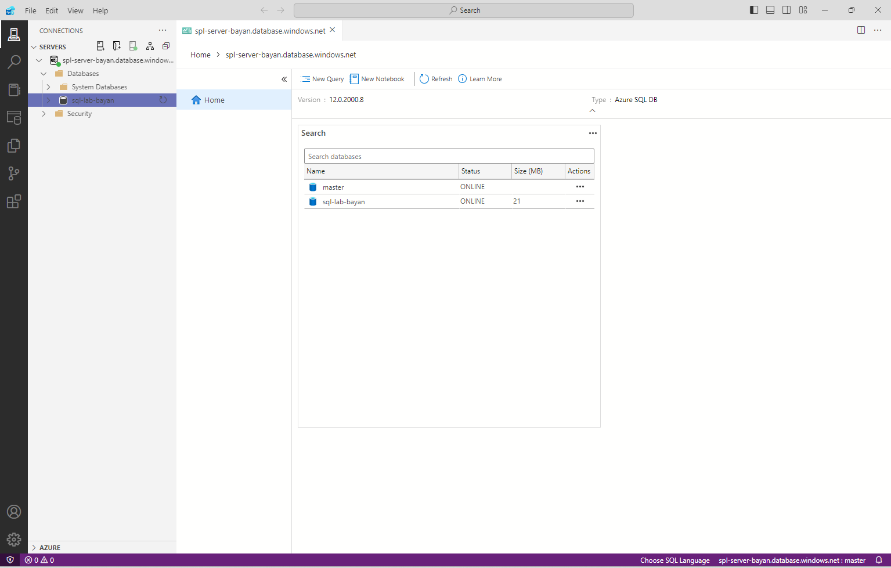

# Lab Solution - Week 2

## Provisioning an Azure SQL Database and Connecting via Azure Data Studio

1. **Create SQL Database**  

2. **Configure Firewall Settings**  

3. **Connect via Azure Data Studio**  

