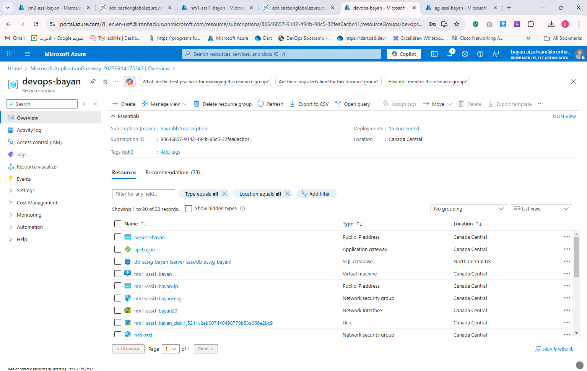
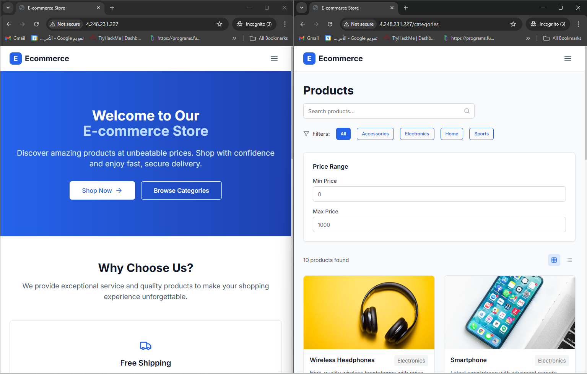
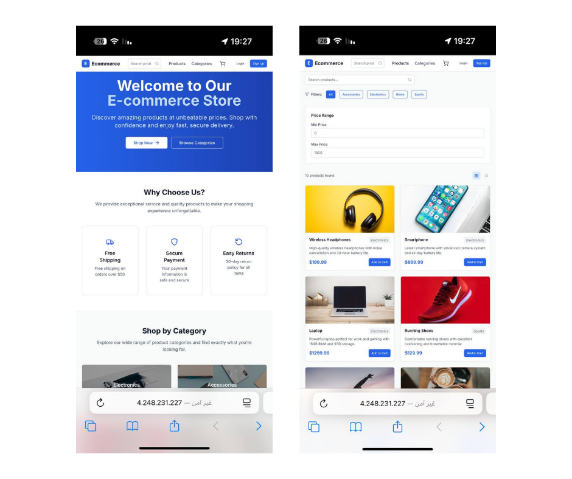

# Lab Solution - Week 2

## Assignment - Deploy a three tier application on Azure Cloud

I started by creating a resource group with networking components (VNet, NSG, Public IP), then provisioned two virtual machines: one for the **Frontend** and another for the **Backend**. Next, I deployed an **Azure SQL Database** and secured it so only the backend could connect.  

On the backend VM, I cloned the repository, configured the `.env` file with database and JWT details, installed dependencies, and started the app. On the frontend VM, I cloned the frontend code, added the API URL in the `.env`, built the app, and served it with Nginx.  

Finally, I set up an **Application Gateway** to route `/` traffic to the frontend and `/api` traffic to the backend. I verified the setup by accessing `/products`, checking data retrieval from the database, and testing user signup/login to confirm full end-to-end functionality.  

# Assignment - Deploy a Three Tier Application on Azure Cloud

## 🚀 Scenario: Deploying a Three-Tier Application on Azure  

I started by creating a resource group with networking components (VNet, NSG, Public IP), then provisioned two virtual machines: one for the **Frontend** and another for the **Backend**. Next, I deployed an **Azure SQL Database** and secured it so only the backend could connect.  

On the backend VM, I cloned the repository, configured the `.env` file with database and JWT details, installed dependencies, and started the app. On the frontend VM, I cloned the frontend code, added the API URL in the `.env`, built the app, and served it with Nginx.  

Finally, I set up an **Application Gateway** to route `/` traffic to the frontend and `/api` traffic to the backend. I verified the setup by accessing `/products`, checking data retrieval from the database, and testing user signup/login to confirm full end-to-end functionality.  

### Resources  

### E-commerce Application  

### Test Backend API  

