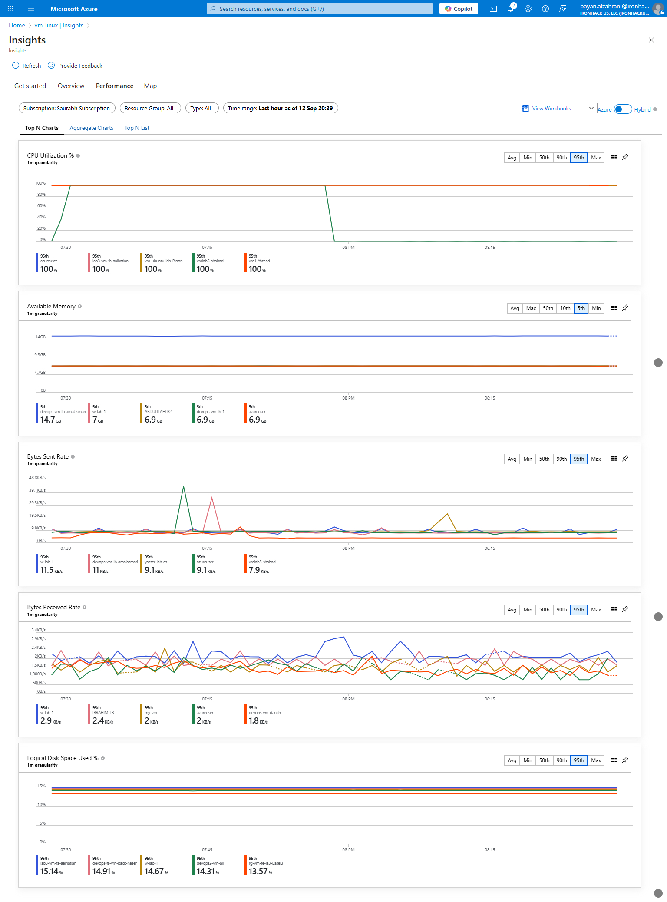
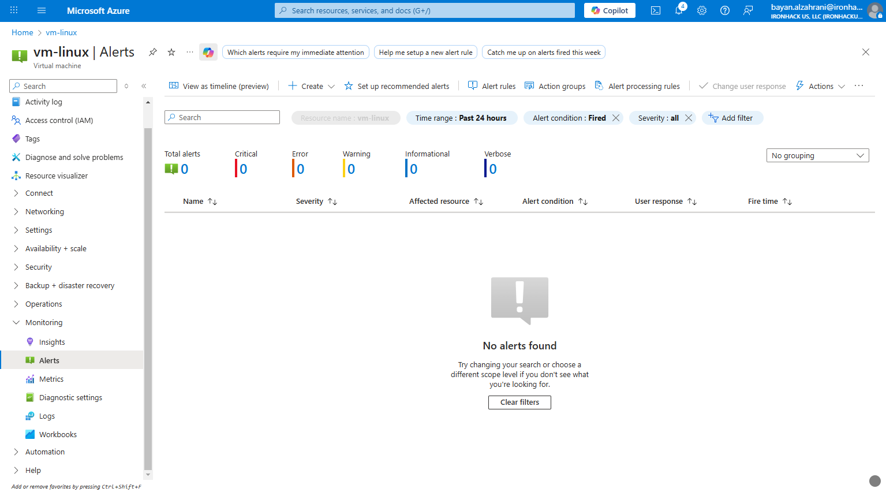
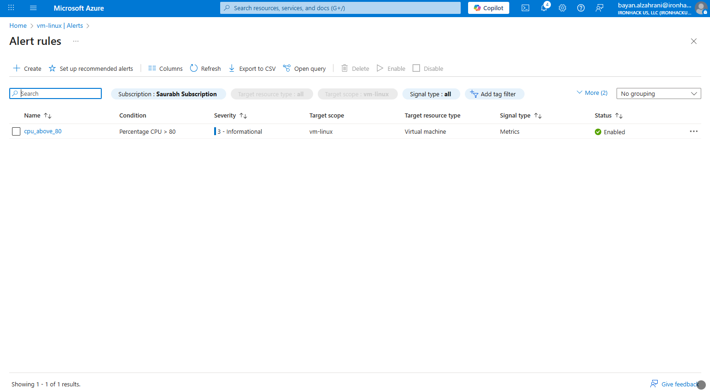
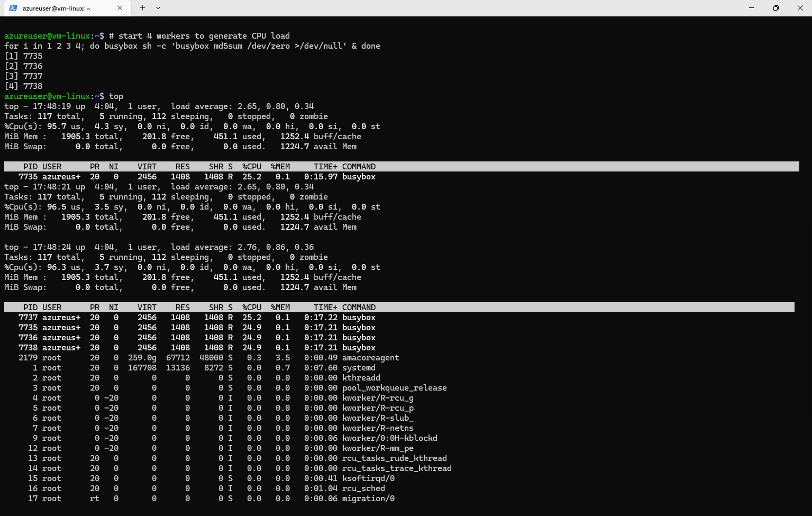
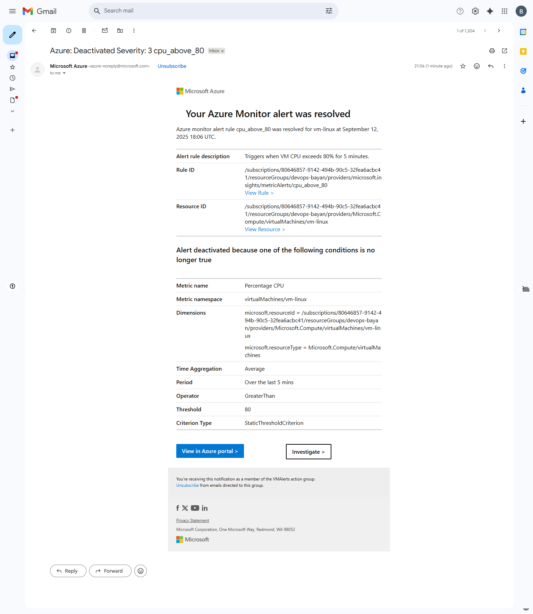

# Lab Solution - Week 2

##  Enabling Azure Monitor for a Linux VM and Configuring Alerts

1. **VM insights**  

2. **Create Alert**  

3. **Alert rule 3**  

4. **VM’s Alerts**  

5. **Email**  

